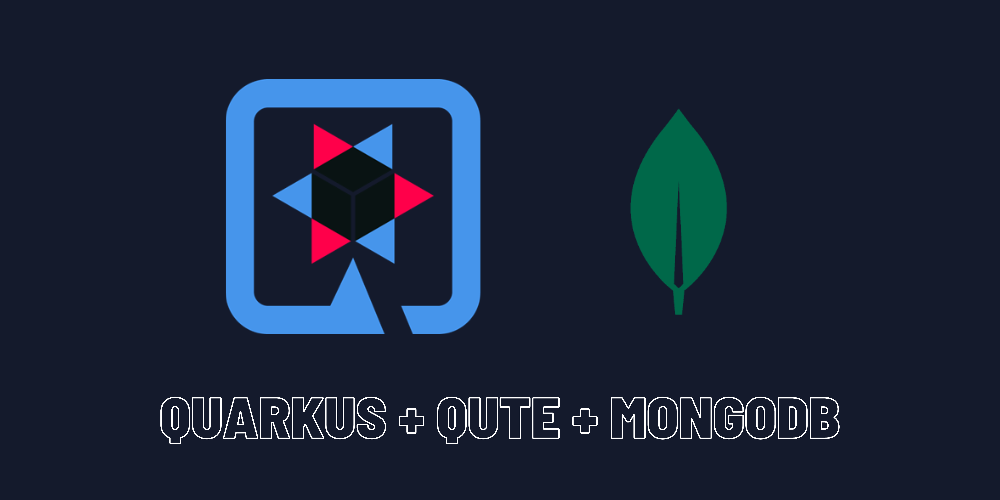

# Todo-App

Welcome to the Todo-App project! This application is a task management tool (To-Do List) built with Quarkus, the Supersonic Subatomic Java Framework.

If you want to learn more about Quarkus, please visit its website: https://quarkus.io/ .

## Overview

This application allows you to manage tasks using a simple web interface. It uses MongoDB for storing tasks and Quarkus to provide a fast and efficient Java development environment.

## Features
- **List Tasks:** View all tasks stored in the MongoDB database.
- **Add Task:** Add a new task to the list.

## Prerequisites

Before you begin, ensure you have the following installed:
- **[Java 17 or later](https://www.oracle.com/java/technologies/downloads/#java11)**
- **[Apache Maven](https://maven.apache.org/download.cgi)**
- **[Docker](https://www.docker.com/)** and **[Docker Compose](https://docs.docker.com/compose/)**

## Setting Up MongoDB

1. Create a docker-compose.yml file in the root of your project (if it doesn't already exist) with the following content:

```yaml
version: '3.8'
services:
  mongodb:
    image: mongo:latest
    container_name: mongodb
    ports:
      - "27017:27017"
    volumes:
      - mongodb_data:/data/db

volumes:
  mongodb_data:
```

2. Start MongoDB using Docker Compose:
```shell script
docker-compose up -d
```
This command will start MongoDB in a detached mode and map port 27017 from the container to your local machine.

3. Verify that MongoDB is running : 

You can check the status of the container using:
```shell script
    docker-compose ps
```

Ensure that the `mongodb` container is up and running.

## Installation


1. Clone the repository:
```shell script
git clone https://github.com/your-username/todo-app.git
```

2. Navigate to the project directory:
```shell script
cd todo-app
```

3. Install the project dependencies:
```shell script
./mvnw clean install
```

## Running in Development Mode

To start the application in development mode, which supports live coding, use:

```shell script
./mvnw compile quarkus:dev
```

Once the application is running, you can access the user interface at http://localhost:8080.

> **_NOTE:_**  Quarkus now ships with a Dev UI, which is available in dev mode only at http://localhost:8080/q/dev/.

## Packaging and running the application

The application can be packaged using:
```shell script
./mvnw package
```
It produces the `quarkus-run.jar` file in the `target/quarkus-app/` directory.
Be aware that it’s not an _über-jar_ as the dependencies are copied into the `target/quarkus-app/lib/` directory.

The application is now runnable using `java -jar target/quarkus-app/quarkus-run.jar`.

If you want to build an _über-jar_, execute the following command:
```shell script
./mvnw package -Dquarkus.package.type=uber-jar
```

The application, packaged as an _über-jar_, is now runnable using `java -jar target/*-runner.jar`.

## Creating an Uber-Jar

To create an uber-jar that includes all dependencies, execute:

```shell script
./mvnw package -Dquarkus.package.type=uber-jar
```

You can then run the uber-jar using:

```shell script
java -jar target/*-runner.jar
```


## Code Structure

-  `Todo`: A model representing a task with attributes such as `id`, `title`, `description`, and `completed`.
-  `̀TodoResource`: A REST resource exposing endpoints to get the list of tasks and add a new task.
- `TodoService`: A service containing business logic for interacting with the MongoDB database.

## Dependencies 

- **Quarkus**: Java framework for fast and efficient applications.
- **MongoDB**: NoSQL database used to store tasks.
- **Qute**: Template engine for generating HTML views.

## Ressources

- **[Quarkus Documentation](https://quarkus.io/guides/)**
- **[MongoDB Documentation](https://docs.mongodb.com/)**
- **[Qute Guide](https://quarkus.io/guides/qute-reference)**

